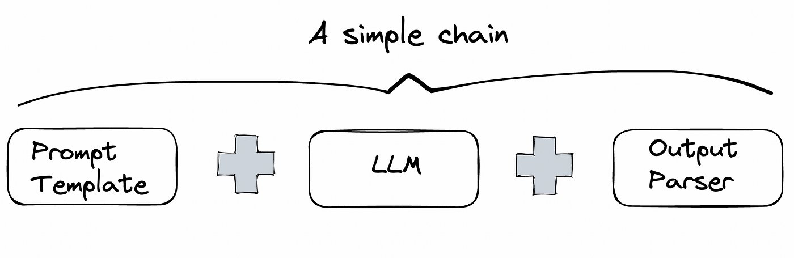

# SQLSleuth: Query Error-handler Chatbot

SQLSleuth is a project designed to handle the user's SQL input queries of different SQL dialects : check their validity in the current DBMS of the provided database, detect any errors, identify their positions, categorize their types, and suggest potential corrections for the queries. This tool aims to assist developers in building their applications with relational databases by providing a robust mechanism for SQL query validation and correction.

For Testing Purposes --> we used Chinook Database upon SQLite3. 

## Overview

The theoretical process of solving SQL query validation and correction involves the use of LangChain and OpenAI's language models. LangChain is a framework for building applications powered by large language models (LLMs). It allows for the creation of chains and agents that interact with databases and natural language inputs.


### Key Concepts

- **Chain**: In LangChain, a chain is a sequence of steps or operations that process input data and produce an output. For SQLSleuth, chains can be used to handle the flow of data from the user's input query through validation, error detection, and correction.



- **Agent**: An agent in LangChain is a more dynamic entity that can make decisions based on the input data. Agents use the ReAct (Reason and Act) framework to process queries, interact with databases or other external resources.. It can also decide which tools or steps to use at each stage of the query processing.


- **ReAct Framework**: ReAct stands for Reason and Act, a framework where agents iteratively reason about the task and act by choosing appropriate steps or tools to use. This approach is useful for complex tasks like SQL query validation, where multiple steps and checks are required.


### Process Flow

1. **Input Query**: The user inputs an SQL query.
2. **Chain or Agent**: The input is passed to either a chain or an agent.
   - **Chain**: Sequentially processes the input through predefined steps (e.g., syntax check, semantic analysis, correction suggestion).
   - **Agent**: Dynamically decides the steps to take based on the ReAct framework.
3. **Validation and Error Detection**: The system checks the query for lexical, syntax, semantic, referential integrity, and logical errors.
4. **Error Correction**: The system suggests corrections for any detected errors.
5. **Output**: The corrected query and an error report is returned to the user.

## Repository Structure

The repository contains several files, each serving a specific purpose in the SQLSleuth project :

- `README.md`: This file, providing an overview and usage instructions for the project.
- `init_*.ipynb`: Jupyter notebooks designed to provide a hands-on introduction to different models:
  - **init_ollama.ipynb**: Demonstrates basic communication with a database using natural language inputs.
  - **init-openai-sql-chain.ipynb**: Demonstrates natural-language communication of a chained-model with a database.
  - **init-openai-sql-agent.ipynb**: Demonstrates natural-language communication of a built-in sql-agent with a database.
- `sql-chain-error-handler.ipynb`: Implements the chain-based approach for handling SQL query errors.
- `sql-agent-error-handler.ipynb`: Implements the agent-based approach for handling SQL query errors.

## Getting Started

To get started with SQLSleuth, follow these steps:

1. Clone the repository:
   ```sh
   git clone https://github.com/LyCrash/SQLSleuth.git
   cd SQLSleuth
2. [OPTIONAL] Run on an isolated python virtual environment
   ```sh
   python -m venv venv
   .\venv\Scripts\Activate
## Contributing
Contributions are welcome! If you have any improvements or new features to suggest, feel free to open a pull request or submit an issue.